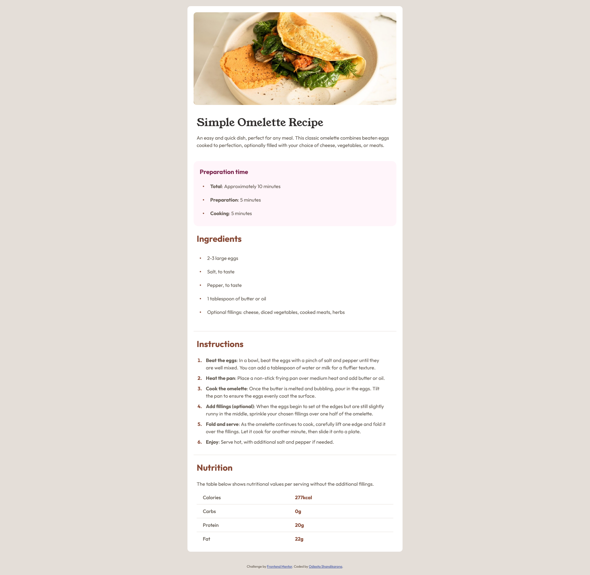
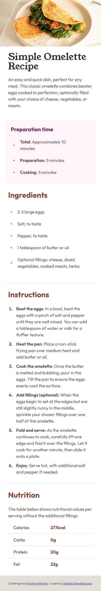

# Frontend Mentor - Recipe page solution

This is a solution to the [Recipe page challenge on Frontend Mentor](https://www.frontendmentor.io/challenges/recipe-page-KiTsR8QQKm). Frontend Mentor challenges help you improve your coding skills by building realistic projects.

## Table of contents

- [Overview](#overview)
  - [The challenge](#the-challenge)
  - [Screenshot](#screenshot)
  - [Links](#links)
- [My process](#my-process)
  - [Built with](#built-with)
  - [What I learned](#what-i-learned)
  - [Continued development](#continued-development)
  - [Useful resources](#useful-resources)
- [Author](#author)

## Overview

### Screenshot




### Links

- Solution URL: [Add solution URL here](https://your-solution-url.com)
- Live Site URL: [Add live site URL here](https://your-live-site-url.com)

## My process

I start with designing it on mobile version. the i write the HTML tag for each content. I wrapped entire content inside container, grouping each content and dividing it as different section. I use the purpose of section as class name to make it easier to distinguish between several same element. In CSS style i separate the selector by writing SECTION `<name> `.

### Built with

- Semantic HTML5 markup
- CSS custom properties
- Flexbox
- CSS Grid
- Mobile-first workflow

### What I learned

The challenge when building the site is how to center the list marker when the content go above one line. To achieve that i set the list item display to flex, set the align-items to center, then adding `::before` pseudo-class for marker. this is how i achieve it

```css
.preparation-item {
  padding: 1rem 0;
  padding-right: 2.5rem;
  display: flex;
  align-items: center;
}

.preparation-item::before {
  content: "\2B24";
  font-size: 0.5rem;
  color: var(--brown-800);
  margin-right: 2rem;
}
```

the list item has display set to flex and align-items set to center. this will make the content inside list item as element. there are two element inside that is marker and text. the `::before` pseudo-element will add marker before the text. the content in pseudo class is a Black Large Circle Unicode character. to set the size i use font-size because unicode is treated as text.

There are unexpected problem that i face as i put `<b>` tag inside the list item and it turn out the bold text and the rest of text as separate element. To fix this i wrapped each content in list inside paragraph. so it will be treated as one element even if it has more inline element like `<span>` or `i` tag.

I use CSS Grid to achieve evenly column in nutrition section. this is a solution that i create

```css
.nutrition-group {
  display: grid;
  grid-template-columns: repeat(2, minmax(0, 1fr));
  padding: 1rem 0;
}
```

the grid-template columns will have 2 evenly width element in one row. the `minmax(0, 1fr)` will make sure the content width can go as low as 0 and as wide as 1fr.

To set the resolution on media queries need to em or px to make it correct. before it i try to use rem but it output strange result like it's not the right result as i calculated base on font-size i define in html selector.

### Continued development

This is the last challenge in frontementor learning paths: Getting started on Frontend Mentor. Next i will start new learning path on Building responsive layout

### Useful resources

- [How can I vertically align a list item marker](https://stackoverflow.com/questions/69874236/how-can-i-vertically-align-a-list-item-marker) - This stackoverflow question help me achieve centering list item marker

## Author

- Frontend Mentor - [@Odiesta](https://www.frontendmentor.io/profile/Odiesta)
- X - [@OdiestaS](https://x.com/OdiestaS)
